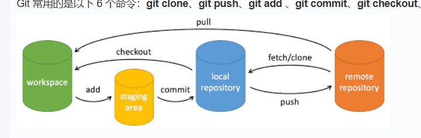

# 一、快速步骤

## 常用命令概述

```
git init 				# 初始化仓库
git remote add origin your_repo.git  # 链接远程仓库
git pull origin main  	# 更新本地仓库至最新改动
git add . 				# 提及到暂存区
git commit -m “commit”  # 将暂存区中的修改提交到本地版本库。
git push origin main  	# 将本地版本库的提交推送到远程仓库。
```

## 1.1 第一次使用

第一次使用，网页端建好仓库后进行以下步骤。

打开我们的项目，此时项目中是没有 .git 文件的
在你的项目文件夹里面【鼠标右击】弹出菜单
在【鼠标右击】弹出的菜单中，点击【Git Bash Here】
在命令窗口中输入：git init
在 Github 中 我们刚刚新建的仓库里，去复制仓库的地址
在命令窗口中输入：git remote add origin 你的仓库地址
在命令窗口中输入：git pull origin main

**特别注意！**自己仓库的主分支的名称是 `master` 还是`main`

在命令窗口中输入：git add .
在命令窗口中输入：git commit -m “提交项目”
在命令窗口中输入：git push origin main
现在可以去 Gitee 你的仓库，刷新一下，本地项目上传到自己的Git仓库中啦！！！

> 详细步骤参考网址：
>
> [将本地项目上传到自己的Git仓库中【超级详细+绝不失败最终版】_git上传文件到仓库-CSDN博客](https://blog.csdn.net/qq_48592827/article/details/121221161)

## 1.2 第N次使用

```
git pull origin main # 对于个人用户来说，当你的远程仓库发生变动，你可以先pull一下以免冲突
git add . 
git commit -m “commit”
git push origin main
```

# 二、基本概念



## 2.1 参考链接

此处给出一些参考链接，链接内容言简意赅，对于有些许经验但是经验又不多的同学或许有帮助：

**Git 工作区、暂存区和版本库**：

[Git 工作区、暂存区和版本库 | 菜鸟教程](https://www.runoob.com/git/git-workspace-index-repo.html)

[工作区和暂存区 - Git教程 - 廖雪峰的官方网站](https://liaoxuefeng.com/books/git/time-travel/working-stage/index.html)

**菜鸟教程简明指南**：

[git 简明指南](https://www.runoob.com/manual/git-guide/)

## 2.2 简单解释

### 2.2.2 工作区 (work space)

工作区 (work space): 本地计算机项目目录

### 2.2.3 暂存区 (staging area)

暂存区 (staging area): 一个临时存储区域，你想要提交的文件add在这里。

**常用命令：**

```
git add filename       # 将单个文件添加到暂存区
git add .              # 将工作区中的所有修改添加到暂存区
git status             # 查看哪些文件在暂存区中
```

`git add` 之后暂存区的目录树被更新。

### 2.2.4 本地版本库 (Repository)

版本库 (Repository): 版本库包含项目的所有版本历史记录。版本库分为本地版本库和远程版本库。这里主要指本地版本库。

**常用命令：**

```
git commit -m "Commit message"   # 将暂存区的更改提交到本地版本库
git log                          # 查看提交历史
git diff                         # 查看工作区和暂存区之间的差异
git diff --cached                # 查看暂存区和最后一次提交之间的差异
```

`git commit` 将暂存区中的修改提交到本地版本库。

### 2.2.5 远程版本库 (GitHub)

远程版本库就是指的GitHub了。

```
git push origin branch-name
```

`git push` 命令将本地版本库的提交推送到远程仓库。

# 三、其他命令

**中性命令：**

- `git reset HEAD`，main分支替换暂存区目录，工作区不受影响。
- `git rm --cached <file>`, 直接从暂存区删除文件，工作区则不做出改变。

**危险命令：**

- `git checkout .`和`git checkout -- <file>`，暂存区的文件会替换工作区文件，会清除工作区中未添加到暂存区中的改动。

**极端危险：**

- `git checkout HEAD .`和`git checkout HEAD <file>`，会用 HEAD 指向的 master 分支中的全部或者部分文件**替换暂存区和以及工作区**中的文件。不但会清除工作区中未提交的改动，也会清除暂存区中未提交的改动。

# 四、疑问

#### 为什么Git要求我们在推送之前先进行拉取操作呢？

这么做的原因是为了避免代码冲突。当我们推送代码之前，如果其他开发者已经在同一文件中做了修改并推送到远程仓库，那么我们推送时就会出现代码冲突的情况。为了避免代码冲突，Git要求我们先进行拉取操作，以便获取最新的代码并合并到我们的本地仓库中。它强制你在本地处理好代码差异（无论是自动合并还是手动解决），确保你推送的是一个整合好的、相对稳定的版本。

#### 如果我和其他开发者都进行了同一文件的修改操作，pull之后会怎么样？我的本地代码会被覆盖吗？

- **`git pull` 后本地代码不会被粗暴覆盖。**
- 如果更改发生在文件不同区域，**Git 会自动合并，两边的修改都会保留**在你的本地文件中。
- 如果更改发生在文件的**同一区域或 Git 无法自动处理**，**合并会暂停，冲突会被标记在你的文件中**。
- **冲突时，Git 将你和同事的冲突版本都留在文件中**，并用特殊符号(`<<<<<<<`, `=======`, `>>>>>>>`)标出冲突位置。你必须手动编辑文件，删除这些标记，决定最终的代码，然后 `git add` 和 `git commit` 来完成合并。
- 你始终可以 `git merge --abort` 来取消未完成的、遇到冲突的合并操作。