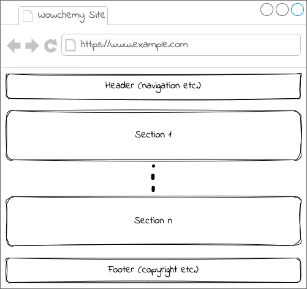

本文提供使用Hugo建立个人网页的详细步骤。

# 一、hugo简介

- 无需编写任何代码即可轻松创建漂亮网站
- Hugo使用一个源文件和模板目录作为输入，用于创建一个完整的网站。
- 构建时间极快，每个页面不到 1 毫秒
- 无须网页编程，仅需调整markdown文件内容进行配置网页即可
- 强大且丰富的主题 
  - [Hugo Themes](https://themes.gohugo.io/) 
  - [25+ Best, Most Popular Hugo Themes for 2024 | Hugo Blox](https://hugoblox.com/templates/)

# 二、快速入门

## 2.1 安装

最新Hugo程序下载地址：[Releases · gohugoio/hugo](https://github.com/gohugoio/hugo/releases)

指定版本下载：[Release v0.136.1 · gohugoio/hugo](https://github.com/gohugoio/hugo/releases/tag/v0.136.1)

建议根据个人需求及主题版本下载指定版本，最新版本可能和某些主题不适配

安装扩展版，版本 v0.112.0 或更高

1. 直接下载到存储位置
2. 解压，安装
3. 添加环境变量
4. 重启电脑
5. 命令行 `hugo version`检查是否安装成功

Git安装自行解决。

## 2.2 主题模板

hugo 提供丰富的主题模板：

- [Hugo Themes](https://themes.gohugo.io/)  
- [25+ Best, Most Popular Hugo Themes for 2024 | Hugo Blox](https://hugoblox.com/templates/)

挑选自己喜欢的模板保存至本地，一般有两种方式，

1. 新建网站后保存主题，参考网址：[快速入门 | Hugo官方文档](https://hugo.opendocs.io/getting-started/quick-start/)
2. 下载主题后直接修改

本文主要是第二种，对 [HugoBlox/theme-academic-cv](https://github.com/HugoBlox/theme-academic-cv) 进行直接修改并进行个性化修改；

文末放出优秀网站参考，也可直接保存优秀网站的源文件进行修改。

# 三、目录及网页结构

## 3.1 目录结构

下载模板后解压，一般目录结构如下：

```
my-site/
├── assets/
│   └── media/
│       └── icons/			<-- 存储icon图标等资源
├── config/					<-- 站点配置文件       
│   └── _default/			<-- 默认		
│       └── hugo.yaml		<-- 全局配置(网站标题等)
│       └── languages.yaml	<-- 语言配置
│       └── menus.yaml		<-- 导航栏配置
│       └── module.yaml		<-- Hugo模块等配置
│       └── params.yaml		<-- 参数配置
├── content/				<-- 内容文件
│   └── _index.md			<-- homepage主页内容配置
│   └── authors/			<-- 主页内容配置
│       └── admin/			<-- 主要作者
│       	└── _index.md	<-- 主要作者内容配置
│       └── xxx/			<-- 其他作者
│   └── xxx/				<-- 主页中其他页面内容
│   └── xxx.md				<-- 单独页面的内容配置
├── layouts/partials		<-- 布局等模板文件
│   └── hooks				<-- 钩子文件，保存一些可复用性的代码
│   └── blox				<-- blok内容块文件，详见3.2
│   └── views				<-- view文件，详见3.2
│   	└── community		<-- 自定义view文件，详见3.2
├── public/       			<-- 构建站点时创建
├── resources/    			<-- 构建站点时创建
├── static/uploads			<-- 供网友下载的PDF等静态文件
```

## 3.2 网页结构



在hugo中，图中的`section`中包含若干个`block`，比方说专门展示文字的`block`、专门用于项目的`block`、专门用于奖项展示的`block`。每个`block`又可以使用不同的`view`，如在展示文章的`block`中可以选择使用竖排`view`、横排`view`、图文`view`、仅文字`view`等。

`Header` 和`Footer`也可以视为`block`的一种。

`block`和`view`的配置主要在content/_index.md中。

# 四、网站运行

## 4.1 运行命令

最常用命令：

```
hugo server  # 构建并运行网站
```

其他命令：

```
hugo serve --disableFastRender  # 在更改时启用完全重新渲染
hugo mod clean --all			# 删除hugo缓存
其他命令见:
	https://hugo.opendocs.io/commands/hugo_server/
```

## 4.2 常见错误解决

### failed to resolve output format：

大部分是由缓存错误引起， 删除缓存后重新构建运行网站：

```
hugo mod clean --all
hugo server
```

### Error: File “not found” or “failed to extract”

Hugo没有找到Blox对应的模块，删除hugo模块缓存后重新拉去模块，而后重新构建运行网站即可：

```
hugo mod clean
hugo mod get -u ./...
hugo server
# 手动删除网站根目录下的.hugo_build.lock文件也可解决大部分问题
```

其他错误参照：[😣 Troubleshooting | Hugo Blox Docs](https://docs.hugoblox.com/reference/troubleshooting/)

# 五、网站部署

- 新建GitHub仓库
- 上传调整后的代码
- Settings中修改仓库名字为`username.github.io`
- Settings——>pages中对`Source`、`Branch`、`Custom domain`等进行配置后发布网页

详细流程及其他部署方法参考：[☁️ Hosting | Hugo Blox Docs](https://docs.hugoblox.com/reference/deployment/)

# 六、优秀网站

> 可进入优秀网站主页后跳转github寻找源码

https://skyao.io/

https://hughandbecky.us/Hugh-CV/

http://cicl.stanford.edu/

[Honghao Chen](https://garychen.top/)
